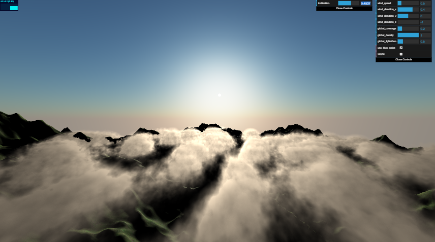

# WebGL Volumetric Cloud :cloud:
This is an individual project for fulfilling the course requirement of COMP5411 Advance Computer Graphics (2019 Fall). This work only aims to replicate the result in [Real-time rendering of volumetric clouds](https://pdfs.semanticscholar.org/89e9/153a091889c584df034a953a0eff4de45ee9.pdf). 

## Screenshot


## Prerequisite
- Please make sure you have [node.js](https://nodejs.org/en/) installed in your computer. 
- Preferably, [Google Chrome](https://www.google.com/chrome/) is recommended since it supposts WebGL2 and `WEBGL_depth_texture` extension. 
- Check your browser [here](https://webglreport.com/?v=2).

## Getting Started
### Running on your machine
```sh
npm install
npm run serve
```
Execute the above commands in terminal and launch your browser. Go to `localhost:8080` to see the demo.
### Live Demo
Check out the [live demo](https://tkchanat.github.io/webgl-volumetric-cloud/) if you want to skip the setup. 

## Camera Controls
`W, A, S, D - Horizonal camera movement`

`Shift, Space - Vertical camera movement`

## Regenerate Noise Map
```sh
node ./src/generate.js
```
**Note:** This could take a long time to generate new maps. Also, specifying custom map seed is currently unavailable.